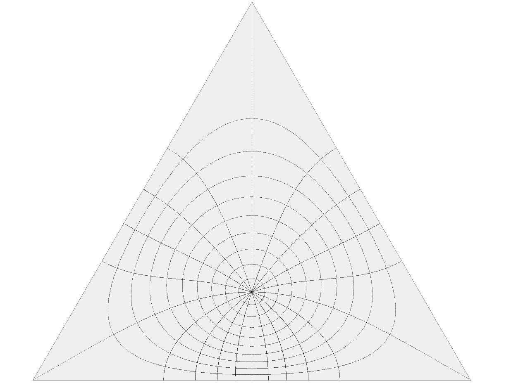
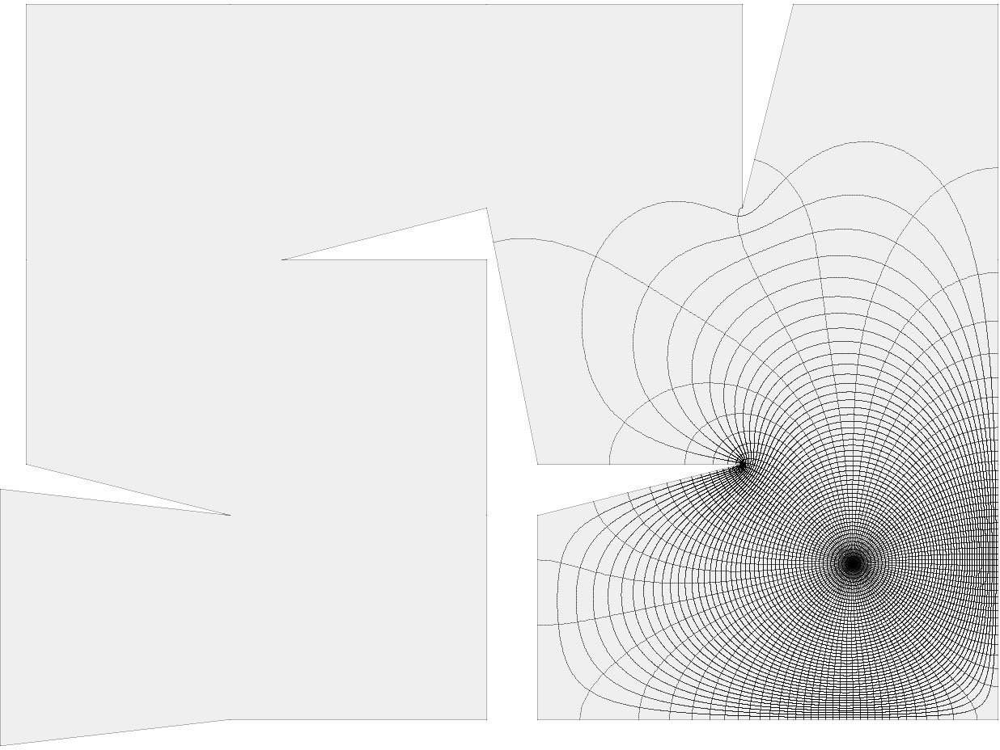
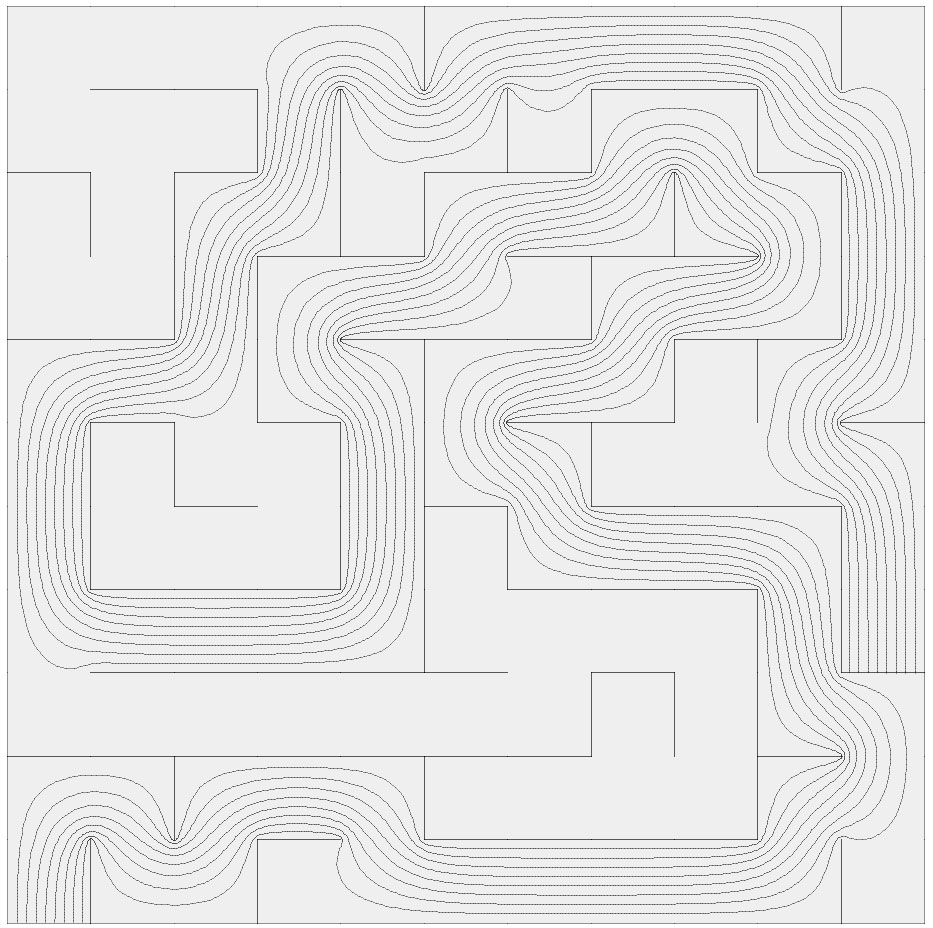
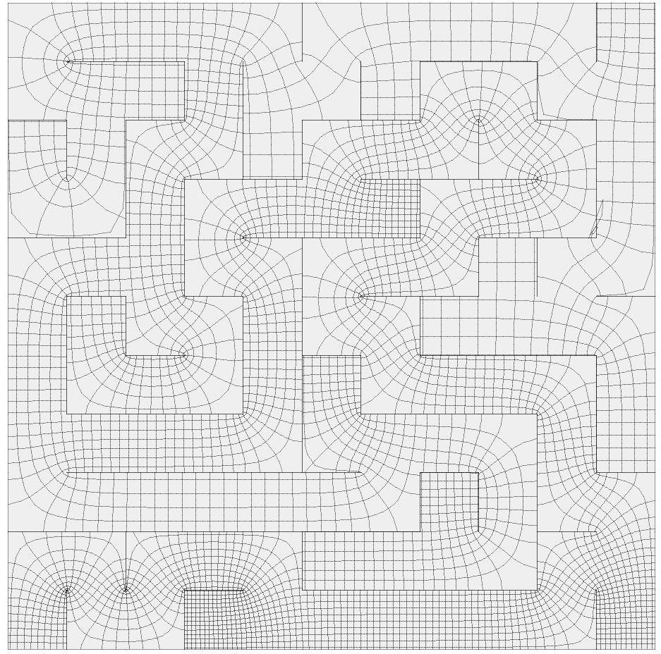

Schwarz-Christoffel Mappings
 from the disk
==========================================

This is a library implementing the CRDT method for approximating Schwarz-Christoffel mappings from the unit disk to the interior of a polygon, as described [here](https://ecommons.library.cornell.edu/bitstream/1813/5567/1/96-233.pdf). This was done for my Bachelorarbeit at the FU Berlin, you can find my thesis [here](https://dl.dropboxusercontent.com/u/105598616/SC.pdf).

Here are a few examples of what those nice functions look like:

